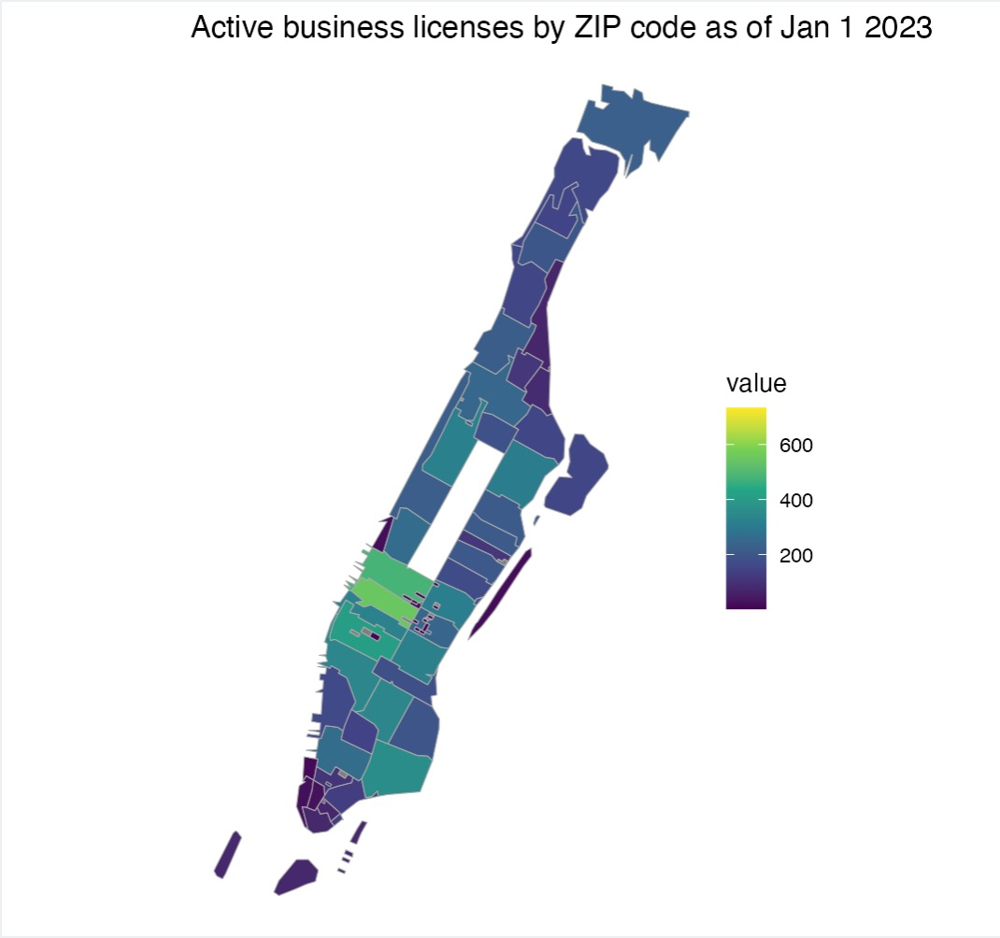

# Project 2: Shiny App Development

### [Project Description](doc/project2_desc.md)




## The Ripple Effects of COVID-19: A Comprehensive Look at its Impact on Health, Work, and Business 
Term: Spring 2023

+ Team 10
+ **Team member** : 
	+ Brendan Ng
	+ Haoyang Li
	+ Jinghan Huang
	+ Sicheng Zhou
	+ Xinyu Zhu
	
+ **Project summary**: Lorem ipsum dolor sit amet, consectetur adipiscing elit, sed do eiusmod tempor incididunt ut labore et dolore magna aliqua. Ut enim ad minim veniam, quis nostrud exercitation ullamco laboris nisi ut aliquip ex ea commodo consequat. Duis aute irure dolor in reprehenderit in voluptate velit esse cillum dolore eu fugiat nulla pariatur. Excepteur sint occaecat cupidatat non proident, sunt in culpa qui officia deserunt mollit anim id est laborum.

+ **Contribution statement**: 
Brendan proposed a dataset, cleaned data for legally operating businesses, developed the choropleth map visualization, and assisted with building the UI.
Sicheng proposed a dataset, cleaned the data for Covid19 cases, developed the analysis in Health Issue, and assisted with builing the UI. 
Jinghan developed the body of UI and server of the shinny app, assisted with cleaning and analyzing the Salary & Work_time & leave_status dataset, assisted with analyzing the health dataset.
Xinyu cleaned and analyzed the Salary & Work_time & leave_status dataset, assisted with builing the UI.
Haoyang assisted with analyzing the Salary&Work_time&leave_status dataset.

Following [suggestions](http://nicercode.github.io/blog/2013-04-05-projects/) by [RICH FITZJOHN](http://nicercode.github.io/about/#Team) (@richfitz). This folder is orgarnized as follows.

```
proj/
├── app/
├── lib/
├── data/
├── doc/
└── output/
```

Please see each subfolder for a README file.

