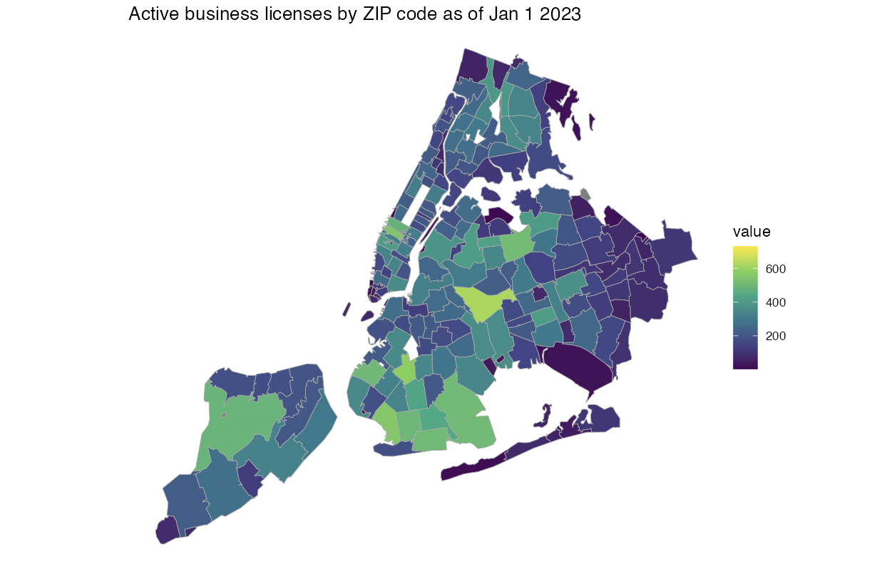

# Project 2: Shiny App Development

### [Project Description](doc/project2_desc.md)




## The Ripple Effects of COVID-19: A Comprehensive Look at its Impact on Health, Work, and Business 
Term: Spring 2023


+ Team 10
+ **Team member** : 
	+ Brendan Ng
	+ Haoyang Li
	+ Jinghan Huang
	+ Sicheng Zhou
	+ Xinyu Zhu
	
+ **Project summary**: This application visualizes business activity data, COVID-related data, and salary data to help the user see a holistic view of how the economy in NYC has changed in the context of COVID-19. Data was sourced from NYC Open Data.
All of our visualizations can be filtered by borough, allowing users to focus on any particular borough of New York that they may be particularly interested in.
The choropleth map of business activity visualizes the amount of active business licenses in each ZIP code, and the slider allows the user to choose which year to visualize. It is apparent that after the pandemic hit, the amount of legally operating businesses throughout New York has decreased.
The health issues tab gives an idea of how the pandemic has affected New York over time, and acts as a proxy for the severity of the pandemic. The weighted version shows case counts/deaths as a proportion of the borough’s population.
The salary/worktime data visualizes how salaries have changed in major agencies over the years of the pandemic. These visualizations provide a high-level overview of whether there has been a change in salary trends before and after the pandemic.

+ **Contribution statement**: 
Brendan proposed a dataset, cleaned data for legally operating businesses, developed the choropleth map visualization, and assisted with building the UI.
Sicheng proposed a dataset, cleaned the data for Covid19 cases, developed the visualization analysis in Health Issue, and assisted with builing the UI. 
Jinghan developed the body of UI and server of the shinny app, assisted with cleaning and analyzing the Salary & Work_time & leave_status dataset, assisted with analyzing the health dataset.
Xinyu cleaned and analyzed the Salary & Work_time & leave_status dataset, deployed the shinny app, and assisted with builing the UI.
Haoyang assisted with analyzing the Salary&Work_time&leave_status dataset.

+ Shinny app: https://uxeg9f-jinghan-huang.shinyapps.io/group10project/ 
You can also run the 'ui.R' or 'server.R' in app/ to use the app.

Following [suggestions](http://nicercode.github.io/blog/2013-04-05-projects/) by [RICH FITZJOHN](http://nicercode.github.io/about/#Team) (@richfitz). This folder is orgarnized as follows.

```
proj/
├── app/
├── lib/
├── data/
├── doc/
└── output/
```

Please see each subfolder for a README file.

